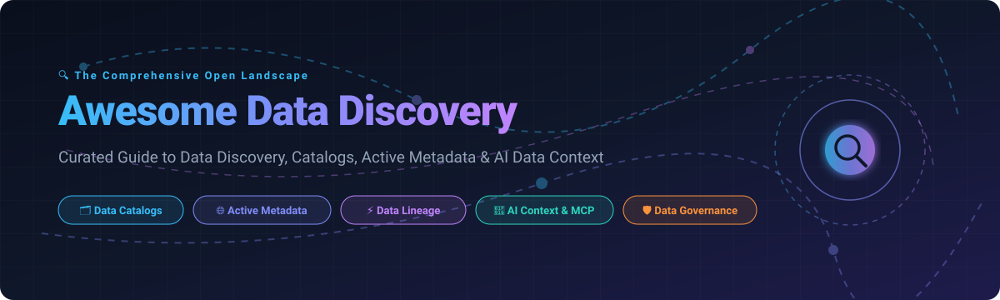

# 🔍 Awesome Data Discovery [](https://github.com/ishandutta2007/Awesome-Awesome-Awesome)

<p align="center">
  
</p>

<p align="center">
  <a href="https://github.com/ishandutta2007/Awesome-Awesome-Awesome"></a><a href="https://discord.gg/jc4xtF58Ve"></a>
  <a href="https://github.com/ishandutta2007/Awesome-Data-Discovery/stargazers"></a>
  <a href="https://github.com/ishandutta2007/Awesome-Data-Discovery/network/members"></a>
  <a href="https://github.com/ishandutta2007/Awesome-Data-Discovery/pulls"></a>
  <a href="https://github.com/ishandutta2007/Awesome-Data-Discovery/blob/main/LICENSE"></a>
  <a href="https://github.com/ishandutta2007"></a>
</p>

---

## 🧭 Top Data Discovery & Data Catalog Platform Ecosystem

> **A curated showcase of premier SaaS products & leading Open-Source GitHub projects for Data Discovery, Active Metadata Management, Automated Data Cataloging, Column-Level Data Lineage, Business Glossaries, Enterprise Data Governance, Data Quality, Semantic Search & AI-Ready Data Context (MCP & LLMs).**  
> 📅 **Last updated: August 2026**

---

### 🌐 Overview & Core Capabilities

Modern enterprise data discovery platforms provide automated **metadata harvesting, semantic data catalogs, full-text & semantic search, business glossaries, data ownership & stewardship, column-level data lineage, profiling, sensitivity classification (PII/GDPR/HIPAA), data quality signals, access governance policies, impact analysis, and AI context layers via Model Context Protocol (MCP)**.

These systems empower data engineers, analytics engineers, data scientists, CDOs, governance teams, and autonomous AI agents to find, trust, govern, and extract value from data distributed across multi-cloud data warehouses, lakehouses, transactional databases, BI tools, transformation engines, APIs, and machine learning pipelines.

---

## 📑 Table of Contents

- [🏢 SaaS & Hosted Platforms](#-saashosted-platforms)
- [⭐ Open-Source GitHub Projects](#-open-source-github-projects)
  - [🗂️ Full Data Catalog & Discovery Platforms](#️-full-data-catalog--discovery-platforms)
  - [📊 Lineage, Transformation & Pipeline Orchestration](#-lineage-transformation--pipeline-orchestration)
  - [🔍 Search, Semantic Engines & Semantic Layer](#-search-semantic-engines--semantic-layer)
  - [📈 Data Portals, Marketplaces & BI Analytics](#-data-portals-marketplaces--bi-analytics)
  - [🛡️ Unified Metadata, Governance & Contract Standards](#️-unified-metadata-governance--contract-standards)
  - [💾 Lakehouse, Table Formats & Storage Metadata](#-lakehouse-table-formats--storage-metadata)
  - [🎯 Data Quality, Profiling & Observability](#-data-quality-profiling--observability)
  - [🕸️ Knowledge Graphs & Semantic Infrastructure](#️-knowledge-graphs--semantic-infrastructure)
- [🏆 Ranked Open-Source Leaderboard](#-ranked-open-source-leaderboard)
- [🏗️ Recommended Open-Source Data Discovery Architecture](#️-recommended-open-source-data-discovery-architecture)
  - [📊 Suggested Discovery Data Model](#-suggested-discovery-data-model)
  - [🔄 Metadata Ingestion Pipeline](#-metadata-ingestion-pipeline)
  - [⚡ Impact Analysis & Column Lineage](#-impact-analysis--column-lineage)
  - [🤖 AI-Assisted Data Discovery Architecture](#-ai-assisted-data-discovery-architecture)
- [📈 Star History](#-star-history)
- [🤝 How to Contribute](#-how-to-contribute)
- [📜 Disclaimer](#-disclaimer)

---

## 🏢 SaaS/Hosted Platforms

The table below is sorted in **descending order by company size** (Market Cap / Valuation / Enterprise Scale).

| 🏢 Platform | 💰 Company Valuation / Revenue | ⚡ Key Capabilities & Description | 💵 Starting Pricing | 🎁 Free Tier / Free Trial Limits |
| :--- | :--- | :--- | :--- | :--- |
| **[Microsoft Purview](https://www.microsoft.com/en-us/security/business/risk-management/microsoft-purview)** | **~$3.10 Trillion Market Cap** ($245B+ ARR) | Multi-cloud data governance, automated Data Map, classification, lineage tracking, and compliance management across hybrid data estates. | Starts at **$0.40 / Capacity Unit (CU) per hour** (~**$292 / month** for 1 CU base: 10 GB metadata storage + 25 ops/sec); **$0.63 / vCore-hour** for automated scanning. | **Free forever tier**: First 1 MB Data Map metadata storage & up to 1,000 annotated assets at $0; **90-day free trial** (25 licenses) for Purview Compliance Suite. |
| **[Google Dataplex Universal Catalog](https://cloud.google.com/dataplex)** | **~$2.10 Trillion Market Cap** ($350B+ ARR) | Unified data and AI governance, automated metadata discovery, data profiling, lineage, and search across Google Cloud. | Starts at **$0.060 / DCU-hour** for standard metadata processing (**$0.089 / DCU-hour** for premium profiling/lineage) + **$2.00 / GiB / month** for metadata storage. | **Free forever tier**: First 100 DCU-hours / month for standard processing, first 1 MiB metadata storage, and first 1,000,000 API calls / month free. |
| **[AWS Glue Data Catalog](https://aws.amazon.com/glue/)** | **~$1.90 Trillion Market Cap** ($600B+ ARR) | Centralized metadata repository and schema registry integrated with AWS data lakes, analytics, Athena, and ETL pipelines. | **$1.00 per 100,000 objects stored / month** and **$1.00 per 1,000,000 requests** (beyond free tier). | **Free forever tier**: First 1,000,000 objects stored and first 1,000,000 requests / month free forever. |
| **[Oracle Enterprise Data Management](https://www.oracle.com/enterprise-data-management/)** | **~$420.0 Billion Market Cap** ($53B+ ARR) | Master data management, enterprise business glossary, dimension governance, metadata management, and auditability on Oracle Cloud EPM. | Starts at **$500 / hosted named user / month** (min. 25 users = **$12,500 / month** / ~$150,000 / year) or **$1.50 / hosted record / year**. | **30-day free trial** with $300 cloud credits via Oracle Cloud Free Tier; enterprise EDM sandbox available via sales request; no permanent free tier. |
| **[IBM Knowledge Catalog](https://www.ibm.com/products/watson-knowledge-catalog)** | **~$200.0 Billion Market Cap** ($62B+ ARR) | Enterprise metadata management, automated data discovery, quality profiling, classification, and AI governance on Cloud Pak for Data. | Starts at **$0.06 / Capacity Unit-Hour (CUH)** or **~$1,500 / month** on IBM Cloud cartridge deployments. | **30-day free trial** with $200 IBM Cloud credits or 30-day Cloud Pak for Data sandbox environment; no permanent free tier. |
| **[Secoda](https://www.secoda.co/)** | **~$50.0 Billion Market Cap** (Parent Atlassian / $4.4B+ ARR) | AI-native data discovery, catalog, automated documentation, lineage, and collaborative data team workspace. | **$0 / month** (Free plan); Paid tiers start at **$99 / month** (or **$50 / user / month** for Core). | **Free forever plan**: Up to 5 users, basic catalog, and workspace search; **14-day free trial** for paid tiers (no credit card required). |
| **[Informatica Cloud Data Governance & Catalog](https://www.informatica.com/)** | **~$8.5 Billion Market Cap** ($1.6B+ ARR) | AI-powered metadata discovery (CLAIRE engine), data cataloging, lineage, and governance on Intelligent Data Management Cloud (IDMC). | Starts at **~$1.20 – $1.50 per Informatica Processing Unit (IPU)**; entry packages start around **$2,500 / month** (~$30,000 / year). | **30-day free trial** for IDMC cloud suite (CDGC catalog module activated upon consultation); no permanent free tier. |
| **[erwin Data Intelligence (Quest)](https://www.erwin.com/)** | **~$5.4 Billion Valuation** (Quest Software / Clearlake / ~$1B+ ARR) | Automated enterprise data cataloging, metadata harvesting, lineage mapping, and business glossary governance. | Starts at **~£4,202 (~$5,400) / user / year** (entry platform packages start around **$25,000 / year**). | **14 to 30-day evaluation trial** upon sales request; no permanent free tier. |
| **[Collibra](https://www.collibra.com/)** | **~$5.25 Billion Valuation** ($250M+ ARR) | Enterprise data intelligence, data governance, metadata catalog, lineage, data quality, and policy management. | Starts at **$150,000 – $170,000 / year** (AWS Marketplace base platform baseline). | **20-day free trial** for Collibra Data Quality & Observability; interactive sandbox tours on demo request; no permanent free tier. |
| **[Precisely Data360](https://www.precisely.com/product/data-integrity/data360)** | **~$3.5 Billion Valuation** (Precisely / Clearlake-TA / ~$1B+ ARR) | Integrated data intelligence, cataloging, quality scoring, lineage, and business-facing metadata governance. | Starts at **$35,000 – $50,000 / year** (base annual enterprise subscription / AWS Marketplace private offer). | **14 to 30-day tailored POC trial** upon mutual agreement with sales; no permanent free tier. |
| **[Alation](https://www.alation.com/)** | **~$1.70 Billion Valuation** ($150M+ ARR) | Enterprise data intelligence platform, behavioral analytics, automated cataloging, search, governance, and stewardship. | Starts at **$60,000 / year** (AWS Marketplace base listing, scaling to ~$198,000/yr for typical enterprise deployments). | **14 to 30-day targeted POC trial** / Snowflake catalog sandbox upon demo request; no permanent free tier. |
| **[Atlan](https://atlan.com/)** | **~$750 Million Valuation** ($50M+ ARR / $105M Series C) | Active-metadata & data context platform; conversational AI/MCP discovery, automated lineage, governance, and business semantics. | Starts at **$15,000 – $25,000 / year** (base tier scaled by active users & connector volume). | **14 to 30-day guided POC trial** with sandbox access upon demo request; no permanent free tier. |
| **[DataHub Cloud (Acryl Data)](https://datahub.com/)** | **~$200 Million Valuation** ($21M+ Series A) | Managed SaaS metadata platform, enterprise governance, automated lineage, MCP connectivity, and AI analytics agents. | Starts at **~$18,000 – $25,000 / year** (managed SaaS starter tier); Open-source core is **$0** self-hosted. | **14-day managed POC trial** with sample cloud connectors; Open-source version is free forever with self-hosting. |
| **[CastorDoc (Coalesce Catalog)](https://www.castordoc.com/)** | **~$150 Million Valuation** ($26M+ funding) | Collaborative data catalog, automated SQL column lineage, metadata search, and governance. | Starts at **~$10,000 / year** (~$50–$100 / user / month entry subscription). | **14-day free trial** upon sales request with pre-configured demo environment; no permanent free tier. |
| **[Zeenea](https://zeenea.com/)** | **~$100 Million Valuation** (Actian / $30M+ funding) | Cloud-native data discovery, metadata graph catalog, data marketplace, data products, and automated lineage. | Starts at **€18,000 (~$19,500) / year** (starter tier: 5 stewards, 50 consumers), scaling to **$40,000+ / year**. | **14-day guided trial / sandbox demo** environment upon request; no permanent free tier. |
| **[DataGalaxy](https://www.datagalaxy.com/)** | **~$60 Million Valuation** ($10M+ Series A) | Data and AI product governance, agile cataloging, business glossary, collaborative lineage, and metadata mapping. | Starts at **$32,000 – $49,950 / year** (annual subscription based on editor licenses and data sources). | **15 to 30-day guided pilot / POC trial** upon demo request; no permanent free tier. |
| **[OvalEdge](https://www.ovaledge.com/)** | **~$40 Million Valuation** (~$10M ARR / Profitable) | End-to-end data catalog, governance workflows, automated lineage, data profiling, and access management. | Starts at **$100 / user / month** (or **$2,000 / month** for Essential tier; **$100 / connector / month**). | **14-day free trial** with full feature access and sample data connectors (no credit card required); no permanent free tier. |
| **[Alex Solutions](https://alexsolutions.com/)** | **~$25 Million Valuation** ($5M+ ARR) | Enterprise data intelligence, metadata harvest, automated lineage, sensitive data discovery, and asset certification. | Starts at **$10,000 / year** (with a structured **$20,000 first-year pilot program**). | **30-day proof-of-concept (POC) sandbox trial** environment upon demo request; no permanent free tier. |

## ⭐ Open-Source GitHub Projects

> *All repositories below include live star badges linking directly to their stargazers page and are sorted in **descending order by star count** within each category.*

### 🗂️ Full Data Catalog & Discovery Platforms

- **[DataHub](https://github.com/datahub-project/datahub)** [](https://github.com/datahub-project/datahub/stargazers)  
  **Enterprise-grade extensible metadata platform & data catalog.** Originally built at LinkedIn, DataHub provides automated discovery, governance, 360-degree observability, real-time lineage, MCP server support, and AI-assisted analytics agents under Apache 2.0.

- **[OpenMetadata](https://github.com/open-metadata/OpenMetadata)** [](https://github.com/open-metadata/OpenMetadata/stargazers)  
  **Unified data catalog, governance & AI context engine.** Combines technical metadata, column-level lineage, integrated data quality testing, team ownership, glossaries, classification tags, data contracts, metrics, and knowledge graphs under Apache 2.0.

- **[Amundsen](https://github.com/amundsen-io/amundsen)** [](https://github.com/amundsen-io/amundsen/stargazers)  
  **Modular data discovery & metadata engine.** Originally developed at Lyft, Amundsen indexes data assets (tables, dashboards, streams, users) using graph backends (Neo4j/Atlas) and search indexes (Elasticsearch/OpenSearch).

- **[CKAN](https://github.com/ckan/ckan)** [](https://github.com/ckan/ckan/stargazers)  
  **Open-source data portal & dataset marketplace platform.** World-leading open data platform powering national data portals, public catalogs, dataset publishing, metadata indexing, search, organizations, and REST APIs.

- **[Apache Atlas](https://github.com/apache/atlas)** [](https://github.com/apache/atlas/stargazers)  
  **Scalable enterprise metadata management and governance framework.** Provides open metadata management, classification, security tagging, dynamic lineage, and integration across the Apache Hadoop/Spark analytics ecosystem.

- **[Magda](https://github.com/magda-io/magda)** [](https://github.com/magda-io/magda/stargazers)  
  **Federated microservice data catalog & discovery platform.** Designed for enterprise and government deployments, providing automated harvesting across internal and external data portals with rich spatial/geographic metadata search.

- **[Open Data Discovery (ODD Platform)](https://github.com/opendatadiscovery-ecosystem/odd-platform)** [](https://github.com/opendatadiscovery-ecosystem/odd-platform/stargazers)  
  **Open metadata, discovery and data observability platform.** Focuses on decentralized metadata ingestion, automated lineage mapping, anomaly alerting, and open metadata standard interoperability.

---

### 📊 Lineage, Transformation & Pipeline Orchestration

- **[Apache Spark](https://github.com/apache/spark)** [](https://github.com/apache/spark/stargazers)  
  **Unified multi-language engine for large-scale data analytics.** Produces execution plans, catalog metadata, and schema information that stream directly into metadata and lineage systems.

- **[Apache Airflow](https://github.com/apache/airflow)** [](https://github.com/apache/airflow/stargazers)  
  **Industry standard workflow orchestration platform.** Emits execution metadata and pipeline run events to feed automated data lineage engines.

- **[Prefect](https://github.com/PrefectHQ/prefect)** [](https://github.com/PrefectHQ/prefect/stargazers)  
  **Modern data workflow orchestration & pipeline coordination.** Provides real-time execution observability, state tracking, and pipeline asset metadata.

- **[Dagster](https://github.com/dagster-io/dagster)** [](https://github.com/dagster-io/dagster/stargazers)  
  **Software-defined asset & orchestration platform.** Native asset-centric data design with built-in metadata tracking, dataset lineage, and partition-level observability.

- **[dbt Core](https://github.com/dbt-labs/dbt-core)** [](https://github.com/dbt-labs/dbt-core/stargazers)  
  **Transformation framework for analytics engineering.** Generates `manifest.json` and `catalog.json` documentation, column descriptions, and lineage dependency graphs for catalog ingestion.

- **[OpenLineage](https://github.com/OpenLineage/OpenLineage)** [](https://github.com/OpenLineage/OpenLineage/stargazers)  
  **Universal open standard for data lineage metadata collection.** Defines an open JSON schema for capturing runtime lineage events from Spark, Flink, Airflow, dbt, and Great Expectations.

- **[Marquez](https://github.com/MarquezProject/marquez)** [](https://github.com/MarquezProject/marquez/stargazers)  
  **Open-source metadata service & reference OpenLineage backend.** Collects, aggregates, and visualizes complex end-to-end dataset and job dependencies across distributed pipelines.

- **[Spline](https://github.com/AbsaOSS/spline)** [](https://github.com/AbsaOSS/spline/stargazers)  
  **Automated data lineage tracking & visualization for Apache Spark.** Captures detailed column-level operations and logical transformation steps transparently.

---

### 🔍 Search, Semantic Engines & Semantic Layer

- **[Meilisearch](https://github.com/meilisearch/meilisearch)** [](https://github.com/meilisearch/meilisearch/stargazers)  
  **Ultra-fast, typo-tolerant search engine.** Excellent for sub-50ms catalog search, dataset discovery, tag filtering, and business glossary lookups.

- **[Typesense](https://github.com/typesense/typesense)** [](https://github.com/typesense/typesense/stargazers)  
  **In-memory, developer-friendly search engine.** High-performance faceted search engine for instant catalog queries, metadata indexing, and typo-tolerant discovery.

- **[Cube](https://github.com/cube-js/cube)** [](https://github.com/cube-js/cube/stargazers)  
  **Universal semantic layer for analytics and AI.** Centralizes data modeling, metric definitions, access control, and semantic queries across data sources.

- **[OpenSearch](https://github.com/opensearch-project/OpenSearch)** [](https://github.com/opensearch-project/OpenSearch/stargazers)  
  **Community-driven search and analytics suite.** Scalable distributed search and vector indexing layer powering enterprise data catalogs like DataHub and OpenMetadata.

- **[Apache Solr](https://github.com/apache/solr)** [](https://github.com/apache/solr/stargazers)  
  **Enterprise search platform built on Apache Lucene.** High-reliability full-text search, faceted navigation, and metadata indexing for massive data repositories.

---

### 📈 Data Portals, Marketplaces & BI Analytics

- **[Apache Superset](https://github.com/apache/superset)** [](https://github.com/apache/superset/stargazers)  
  **Enterprise business intelligence & visualization platform.** Connects to any SQL database, exposes table/column metadata, metrics, dashboards, and virtual dataset layers for discovery.

- **[Metabase](https://github.com/metabase/metabase)** [](https://github.com/metabase/metabase/stargazers)  
  **Intuitive open-source analytics & business intelligence.** Auto-generates data dictionaries, model definitions, question lineage, and self-service exploration.

- **[Data Commons](https://github.com/datacommonsorg)** [](https://github.com/datacommonsorg/stargazers)  
  **Open knowledge graph of public datasets.** Synthesizes thousands of public datasets (demographics, health, climate, economics) into an interconnected schema based on Schema.org.

---

### 🛡️ Unified Metadata, Governance & Contract Standards

- **[Apache Gravitino](https://github.com/apache/gravitino)** [](https://github.com/apache/gravitino/stargazers)  
  **Unified multi-cloud metadata management system.** Provides unified catalog abstractions across relational databases, data lakes, messaging brokers, and AI model registries.

- **[Grai Core](https://github.com/grai-io/grai-core)** [](https://github.com/grai-io/grai-core/stargazers)  
  **Data lineage and dependency graph framework.** Programmatic engine for testing schema changes and verifying downstream impact in CI/CD pipelines before deployment.

- **[Open Data Contract Standard (ODCS)](https://github.com/bitol-io/open-data-contract-standard)** [](https://github.com/bitol-io/open-data-contract-standard/stargazers)  
  **Vendor-neutral standard for data contracts.** Defines YAML specifications for data schema declarations, SLA definitions, data quality rules, and consumer-producer agreements.

- **[OpenMetadata Standards](https://github.com/open-metadata/OpenMetadata-standards)** [](https://github.com/open-metadata/OpenMetadata-standards/stargazers)  
  **Standardized JSON Schema definitions for active metadata.** Community-driven specifications covering tables, pipelines, dashboards, ML models, quality tests, and data products.

- **[Egeria](https://github.com/odpi/egeria)** [](https://github.com/odpi/egeria/stargazers)  
  **Open metadata and governance standard ecosystem.** Supports federated metadata exchange, automated governance workflows, and cross-catalog synchronization under ODPi.

- **[Metaphor Connectors](https://github.com/Metaphor-Data/connectors)** [](https://github.com/Metaphor-Data/connectors/stargazers)  
  **Open-source metadata ingestion extractors.** Modular Python connectors for extracting schemas, queries, usage logs, and lineage from popular modern data stack tools.

---

### 💾 Lakehouse, Table Formats & Storage Metadata

- **[DuckDB](https://github.com/duckdb/duckdb)** [](https://github.com/duckdb/duckdb/stargazers)  
  **In-process analytical SQL database management system.** Reads parquet/lakehouse metadata directly and acts as a fast querying engine for local metadata analysis.

- **[Delta Lake](https://github.com/delta-io/delta)** [](https://github.com/delta-io/delta/stargazers)  
  **Open-source storage framework for lakehouses.** Provides ACID transactions, schema enforcement, time-travel history, and commit log metadata for table-level discovery.

- **[Apache Iceberg](https://github.com/apache/iceberg)** [](https://github.com/apache/iceberg/stargazers)  
  **High-performance open table format for analytic datasets.** Manages table snapshots, schema evolution, partition specifications, and manifest files accessible by catalogs.

- **[Apache Hudi](https://github.com/apache/hudi)** [](https://github.com/apache/hudi/stargazers)  
  **Transactional data-lake platform.** Offers stream-native storage, incremental upserts, file sizing metadata, and schema tracking for data lake discovery.

- **[Project Nessie](https://github.com/projectnessie/nessie)** [](https://github.com/projectnessie/nessie/stargazers)  
  **Transactional catalog with Git-like semantics for data lakes.** Enables branching, merging, and version-controlled metadata commits across Iceberg and Delta tables.

---

### 🎯 Data Quality, Profiling & Observability

- **[Great Expectations](https://github.com/great-expectations/great_expectations)** [](https://github.com/great-expectations/great_expectations/stargazers)  
  **Shared standard for data pipeline testing and validation.** Automatically generates dataset documentation, validation reports, and trust badges for catalogs.

- **[Pandera](https://github.com/unionai-oss/pandera)** [](https://github.com/unionai-oss/pandera/stargazers)  
  **Statistical data validation library for Python dataframes.** Enforces dataframe schemas at runtime (pandas, polars, pyspark) and generates schema metadata.

- **[Deequ](https://github.com/awslabs/deequ)** [](https://github.com/awslabs/deequ/stargazers)  
  **Automated data quality verification library for Apache Spark.** Computes large-scale dataset profiling metrics, constraints, and statistical quality scores.

- **[Elementary](https://github.com/elementary-data/elementary)** [](https://github.com/elementary-data/elementary/stargazers)  
  **dbt-native data observability and monitoring platform.** Provides anomaly detection, schema change alerts, model performance metrics, and test lineage.

- **[Soda Core](https://github.com/sodadata/soda-core)** [](https://github.com/sodadata/soda-core/stargazers)  
  **CLI & Python library for data reliability testing.** Executes SodaCL YAML checks against databases and streams quality verification signals to catalogs.

- **[Whylogs](https://github.com/whylabs/whylogs)** [](https://github.com/whylabs/whylogs/stargazers)  
  **Statistical data profiling library for tabular and text data.** Creates lightweight, mergeable mathematical profiles to monitor data drift and quality in catalogs.

---

### 🕸️ Knowledge Graphs & Semantic Infrastructure

- **[Apache Jena](https://github.com/apache/jena)** [](https://github.com/apache/jena/stargazers)  
  **Open-source RDF and semantic web framework.** Enables SPARQL querying, ontology modeling (OWL/RDFS), and semantic relationship graphs for enterprise glossaries.

- **[JanusGraph](https://github.com/JanusGraph/janusgraph)** [](https://github.com/JanusGraph/janusgraph/stargazers)  
  **Scalable distributed graph database.** Powers petabyte-scale lineage graphs and multi-hop metadata traversal backed by Cassandra, HBase, or BerkeleyDB.

- **[Apache AGE](https://github.com/apache/age)** [](https://github.com/apache/age/stargazers)  
  **Graph extension for PostgreSQL.** Brings openCypher graph query capabilities into relational PostgreSQL stores for lightweight metadata graph indexing.

## 🏆 Ranked Open-Source Leaderboard

*Top open-source projects across the entire data discovery, metadata, lineage, quality, and search landscape (sorted by star count descending):*

1. **[Apache Superset](https://github.com/apache/superset)** [](https://github.com/apache/superset/stargazers) — Enterprise BI, visualization & dataset discovery
2. **[Meilisearch](https://github.com/meilisearch/meilisearch)** [](https://github.com/meilisearch/meilisearch/stargazers) — Ultra-fast metadata and glossary search engine
3. **[Apache Spark](https://github.com/apache/spark)** [](https://github.com/apache/spark/stargazers) — Big data analytics and transformation engine
4. **[Apache Airflow](https://github.com/apache/airflow)** [](https://github.com/apache/airflow/stargazers) — Pipeline workflow orchestration & execution events
5. **[Metabase](https://github.com/metabase/metabase)** [](https://github.com/metabase/metabase/stargazers) — Open-source data exploration, dictionary & analytics
6. **[DuckDB](https://github.com/duckdb/duckdb)** [](https://github.com/duckdb/duckdb/stargazers) — Fast in-process SQL metadata engine
7. **[Typesense](https://github.com/typesense/typesense)** [](https://github.com/typesense/typesense/stargazers) — Typo-tolerant fast catalog search engine
8. **[Cube](https://github.com/cube-js/cube)** [](https://github.com/cube-js/cube/stargazers) — Universal semantic layer & metric catalog
9. **[Prefect](https://github.com/PrefectHQ/prefect)** [](https://github.com/PrefectHQ/prefect/stargazers) — Workflow coordination & pipeline asset tracking
10. **[Dagster](https://github.com/dagster-io/dagster)** [](https://github.com/dagster-io/dagster/stargazers) — Asset-native orchestration & metadata graph
11. **[dbt Core](https://github.com/dbt-labs/dbt-core)** [](https://github.com/dbt-labs/dbt-core/stargazers) — Transformation metadata, tests & schema docs
12. **[OpenSearch](https://github.com/opensearch-project/OpenSearch)** [](https://github.com/opensearch-project/OpenSearch/stargazers) — Distributed search & vector layer for metadata
13. **[Great Expectations](https://github.com/great-expectations/great_expectations)** [](https://github.com/great-expectations/great_expectations/stargazers) — Automated data quality & schema testing
14. **[DataHub](https://github.com/datahub-project/datahub)** [](https://github.com/datahub-project/datahub/stargazers) — Extensible metadata platform, catalog & lineage
15. **[Delta Lake](https://github.com/delta-io/delta)** [](https://github.com/delta-io/delta/stargazers) — Storage layer & transaction log metadata
16. **[OpenMetadata](https://github.com/open-metadata/OpenMetadata)** [](https://github.com/open-metadata/OpenMetadata/stargazers) — Data catalog, governance & AI context engine
17. **[Apache Iceberg](https://github.com/apache/iceberg)** [](https://github.com/apache/iceberg/stargazers) — Table metadata snapshots & partition catalog
18. **[Apache Hudi](https://github.com/apache/hudi)** [](https://github.com/apache/hudi/stargazers) — Transactional data lake storage metadata
19. **[Amundsen](https://github.com/amundsen-io/amundsen)** [](https://github.com/amundsen-io/amundsen/stargazers) — Searchable data discovery platform
20. **[CKAN](https://github.com/ckan/ckan)** [](https://github.com/ckan/ckan/stargazers) — Open data catalog & portal ecosystem
21. **[Pandera](https://github.com/unionai-oss/pandera)** [](https://github.com/unionai-oss/pandera/stargazers) — Python dataframe validation & typing
22. **[Deequ](https://github.com/awslabs/deequ)** [](https://github.com/awslabs/deequ/stargazers) — Spark automated data quality & profiling
23. **[Elementary](https://github.com/elementary-data/elementary)** [](https://github.com/elementary-data/elementary/stargazers) — dbt-native data observability
24. **[Soda Core](https://github.com/sodadata/soda-core)** [](https://github.com/sodadata/soda-core/stargazers) — Data reliability testing & SodaCL checks
25. **[Apache Atlas](https://github.com/apache/atlas)** [](https://github.com/apache/atlas/stargazers) — Hadoop/Spark metadata governance framework
26. **[OpenLineage](https://github.com/OpenLineage/OpenLineage)** [](https://github.com/OpenLineage/OpenLineage/stargazers) — Open lineage collection standard
27. **[Marquez](https://github.com/MarquezProject/marquez)** [](https://github.com/MarquezProject/marquez/stargazers) — OpenLineage collection & graph service
28. **[Apache Gravitino](https://github.com/apache/gravitino)** [](https://github.com/apache/gravitino/stargazers) — Multi-cloud unified metadata system
29. **[Project Nessie](https://github.com/projectnessie/nessie)** [](https://github.com/projectnessie/nessie/stargazers) — Git-like transactional catalog for lakes
30. **[Whylogs](https://github.com/whylabs/whylogs)** [](https://github.com/whylabs/whylogs/stargazers) — Statistical data profiling & drift telemetry
31. **[Magda](https://github.com/magda-io/magda)** [](https://github.com/magda-io/magda/stargazers) — Federated public & enterprise data portal
32. **[Grai Core](https://github.com/grai-io/grai-core)** [](https://github.com/grai-io/grai-core/stargazers) — Lineage graph & CI/CD change impact engine
33. **[Spline](https://github.com/AbsaOSS/spline)** [](https://github.com/AbsaOSS/spline/stargazers) — Automated Spark column lineage tracker
34. **[Open Data Contract Standard](https://github.com/bitol-io/open-data-contract-standard)** [](https://github.com/bitol-io/open-data-contract-standard/stargazers) — Data contract YAML specification
35. **[Open Data Discovery](https://github.com/opendatadiscovery-ecosystem/odd-platform)** [](https://github.com/opendatadiscovery-ecosystem/odd-platform/stargazers) — Metadata, observability & discovery
36. **[Egeria](https://github.com/odpi/egeria)** [](https://github.com/odpi/egeria/stargazers) — Open metadata exchange & governance standard

## Recommended Open-Source Data Discovery Stack

For organizations wanting to build an **open-source alternative to Atlan, Secoda, CastorDoc, Alation, Collibra, Microsoft Purview, IBM Watson Knowledge Catalog, OvalEdge or DataGalaxy**, a practical architecture could combine:

**Data Catalog Core**

`DataHub / OpenMetadata / Apache Atlas / Amundsen`

↓

**Metadata Ingestion**

`Connectors + OpenMetadata Ingestion + DataHub Ingestion`

↓

**Metadata Repository**

`PostgreSQL / Elasticsearch-compatible Search / Graph Store`

↓

**Search & Discovery**

`OpenSearch / Solr / Meilisearch`

↓

**Lineage**

`OpenLineage + Marquez + dbt + Airflow/Dagster`

↓

**Data Quality**

`Great Expectations / Soda Core / Elementary / Deequ`

↓

**Business Semantics**

`Glossary + Ontology + Tags + Classifications + Metrics`

↓

**Knowledge Graph**

`Apache Jena / JanusGraph / Apache AGE`

↓

**Data Marketplace**

`CKAN / Custom Data Product Portal`

↓

**Analytics**

`PostHog / Grafana / Metabase / Superset`

A particularly strong open-source combination is:

**OpenMetadata + OpenLineage + Great Expectations + OpenSearch + PostgreSQL + Apache Jena + dbt + Airflow**

For an enterprise-scale metadata platform:

**DataHub + OpenLineage + Kafka + Elasticsearch/OpenSearch + PostgreSQL + dbt + Great Expectations**

For a lightweight data catalog:

**Amundsen + PostgreSQL + OpenSearch + dbt**

For a public/open-data marketplace:

**CKAN + OpenSearch + PostgreSQL + Apache Jena**

For an AI-first data-discovery platform:

**OpenMetadata/DataHub + OpenSearch + semantic embeddings + knowledge graph + MCP + LLM**

### Suggested Data Discovery Data Model

```text
Data Estate
 ├── Data Source
 │    ├── Database
 │    ├── Warehouse
 │    ├── Data Lake
 │    ├── API
 │    ├── BI Platform
 │    └── ML Platform
 │
 ├── Data Asset
 │    ├── Database
 │    ├── Schema
 │    ├── Table
 │    ├── Column
 │    ├── View
 │    ├── Dashboard
 │    ├── Report
 │    ├── Metric
 │    ├── Pipeline
 │    └── ML Model
 │
 ├── Metadata
 │    ├── Description
 │    ├── Owner
 │    ├── Steward
 │    ├── Tags
 │    ├── Classification
 │    ├── Glossary
 │    └── Domain
 │
 ├── Lineage
 │    ├── Upstream
 │    ├── Downstream
 │    ├── Column Lineage
 │    └── Impact
 │
 ├── Quality
 │    ├── Freshness
 │    ├── Completeness
 │    ├── Accuracy
 │    ├── Uniqueness
 │    └── Quality Score
 │
 └── Governance
      ├── Policy
      ├── Certification
      ├── Access
      ├── Contract
      └── Retention

The key architectural principle should be:

Every data asset should be discoverable together with its business meaning, owner, lineage, quality, usage, governance status and relationships to other assets.

A modern data-discovery platform should therefore connect:

Data Source → Asset → Metadata → Semantics → Lineage → Quality → Ownership → Governance → Usage → AI Context

Metadata Ingestion Architecture
                         ┌──────────────────────┐
                         │     Data Sources      │
                         └──────────┬───────────┘
                                    │
          ┌─────────────────────────┼─────────────────────────┐
          │                         │                         │
    ┌─────▼─────┐             ┌─────▼─────┐             ┌─────▼─────┐
    │ Warehouse │             │ BI / ETL  │             │ ML / APIs │
    │ / Lake    │             │ / dbt     │             │ / Apps    │
    └─────┬─────┘             └─────┬─────┘             └─────┬─────┘
          │                         │                         │
          └─────────────────────────┼─────────────────────────┘
                                    │
                           ┌────────▼────────┐
                           │ Metadata Ingest  │
                           │ DataHub / OMD    │
                           │ OpenLineage      │
                           └────────┬─────────┘
                                    │
                       ┌────────────▼────────────┐
                       │   Metadata Repository   │
                       │ PostgreSQL / Search /   │
                       │ Graph / Event Store     │
                       └────────────┬────────────┘
                                    │
                ┌───────────────────┼───────────────────┐
                │                   │                   │
         ┌──────▼──────┐     ┌──────▼──────┐     ┌──────▼──────┐
         │ Search      │     │ Knowledge   │     │ Lineage     │
         │ OpenSearch  │     │ Graph       │     │ OpenLineage │
         │ Solr        │     │ Jena/Graph  │     │ Marquez     │
         └──────┬──────┘     └──────┬──────┘     └──────┬──────┘
                │                   │                   │
                └───────────────────┼───────────────────┘
                                    │
                          ┌─────────▼──────────┐
                          │ Data Discovery UI  │
                          │ Search + Catalog   │
                          │ Lineage + Quality  │
                          └────────────────────┘
Data Discovery Workflow
Data Source
    ↓
Metadata Extraction
    ↓
Metadata Normalization
    ↓
Asset Registration
    ↓
Ownership
    ↓
Business Glossary
    ↓
Classification
    ↓
Quality Profiling
    ↓
Lineage
    ↓
Certification
    ↓
Search / Discovery
    ↓
Data Consumption
Search & Discovery Layer

A strong catalog should support multiple discovery modes:

Keyword Search
      +
Semantic Search
      +
Business Glossary
      +
Filters
      +
Lineage
      +
Usage
      +
Ownership

Users should be able to search for:

Dataset names

Columns

Business terms

Metrics

Dashboards

Reports

Owners

Domains

Tags

Classifications

SQL queries

Data products

Data contracts

Certifications

Modern platforms increasingly add conversational search and AI/MCP access. Atlan, for example, supports conversational discovery and MCP-based access to catalog context. 
Atlan Documentation

Data Lineage Architecture
Source
  ↓
ETL / ELT
  ↓
Transformation
  ↓
Table
  ↓
Column
  ↓
Metric
  ↓
Dashboard
  ↓
Business Decision

Lineage should support:

Dataset Lineage
      +
Column Lineage
      +
Pipeline Lineage
      +
Dashboard Lineage
      +
Metric Lineage

OpenLineage is particularly useful for standardizing lineage events across pipeline systems.

Impact Analysis
Column Changed
      ↓
Upstream / Downstream Graph
      ↓
 ┌───────────────┬───────────────┬──────────────┐
 │               │               │
Pipelines      Dashboards      Reports
 │               │               │
 └───────────────┴───────────────┘
                 ↓
          Impact Assessment
                 ↓
          Owner Notification

A mature data-discovery platform should answer:

What breaks if this column changes?

Which dashboards use this table?

Which pipelines depend on this dataset?

Which metrics depend on this column?

Which business teams use this asset?

Business Glossary Layer
Business Concept
      ↓
Glossary Term
      ↓
Definition
      ↓
Owner
      ↓
Related Data Assets
      ↓
Metrics
      ↓
Policies

For example:

Customer
 ├── Definition
 ├── Customer ID
 ├── Customer Segment
 ├── Customer Revenue
 ├── Customer Status
 └── Customer Data Policy

This bridges the gap between technical metadata and business understanding.

Data Quality & Trust Layer
Dataset
  ↓
Profiling
  ↓
Quality Tests
  ↓
Freshness
  ↓
Completeness
  ↓
Uniqueness
  ↓
Quality Score
  ↓
Certification

A useful trust model is:

Unverified
    ↓
Profiled
    ↓
Tested
    ↓
Owned
    ↓
Documented
    ↓
Certified
    ↓
Trusted Data Product
Data Classification

A catalog should automatically identify sensitive information:

Column
  ↓
Classification Engine
  ↓
 ┌─────────────┬─────────────┬──────────────┐
 │             │             │
PII          Financial      Health
 │             │             │
 └─────────────┴─────────────┘
              ↓
        Governance Policy

Potential classifications include:

Personally identifiable information

Financial information

Authentication information

Health information

Confidential business information

Intellectual property

Public information

Data Product Layer

A modern catalog can evolve from a simple inventory into a data-product marketplace:

Raw Dataset
    ↓
Curated Dataset
    ↓
Data Product
    ↓
Owner
    ↓
Documentation
    ↓
Quality SLA
    ↓
Access Policy
    ↓
Consumers

A data product should include:

Business description

Owner

Domain

Schema

Quality score

SLA

Lineage

Access requirements

Documentation

Usage statistics

Certification

AI-Assisted Data Discovery

An open-source catalog can add AI capabilities:

Catalog Metadata
      ↓
Semantic Layer
      ↓
Knowledge Graph
      ↓
Embeddings / Vector Search
      ↓
LLM / AI Agent
      ↓
 ┌──────────────┬───────────────┬──────────────┐
 │              │               │
Search         Explain        Recommend
 │              │               │
 └──────────────┴───────────────┘
                      ↓
                Data Consumer

Potential AI functions include:

Natural-language data search

Dataset recommendations

Business-term discovery

Automatic documentation

Metadata generation

Column descriptions

Data classification

Lineage explanation

Impact analysis

SQL generation

Metric discovery

Data-quality explanation

Duplicate-asset detection

Data-product recommendations

OpenMetadata and DataHub are particularly relevant to this emerging model: OpenMetadata describes itself as an open context layer for humans, AI assistants and agents, while DataHub now includes an open-source analytics agent and MCP connectivity. 
GitHub
+1

AI Data Discovery Architecture
                         ┌──────────────────────┐
                         │   Human / AI Agent   │
                         └──────────┬───────────┘
                                    │
                            Natural Language
                                    │
                         ┌──────────▼──────────┐
                         │   Semantic Search   │
                         │ Embeddings + Search  │
                         └──────────┬──────────┘
                                    │
                  ┌─────────────────▼─────────────────┐
                  │       Metadata Knowledge Graph    │
                  │                                   │
                  │ Assets + Owners + Lineage         │
                  │ Glossary + Quality + Policies     │
                  └─────────────────┬─────────────────┘
                                    │
                         ┌──────────▼──────────┐
                         │   Governed Context   │
                         │  ACL + Policies      │
                         └──────────┬──────────┘
                                    │
                         ┌──────────▼──────────┐
                         │ AI Answer / Action   │
                         └──────────────────────┘

The AI layer should never treat raw metadata as sufficient context. Business definitions, ownership, lineage, quality, access policies and governance information should accompany the data-discovery response.

## 📈 Star History

[](https://star-history.dera.page/#ishandutta2007/Awesome-Data-Discovery&type=date&legend=top-left)

---

## 🤝 How to Contribute

Contributions are warmly welcomed! To contribute:

1. 🍴 **Fork** this repository.
2. 🌿 **Create a branch**: `git checkout -b add-my-tool`.
3. 📝 **Add/Update entries** in `README.md` (following the existing table / badge format).
4. 🔗 Ensure all links point to official project websites or GitHub repositories.
5. 🚀 **Submit a Pull Request** with a brief description of why the tool is valuable.
6. ⭐ **Star this repository** if you find it helpful!

---

## 📜 Disclaimer

*This is a community-curated list — not exhaustive and not an endorsement. Data discovery, data cataloging, active metadata management, lineage, data governance, and data observability are distinct yet intersecting disciplines. Verify license terms, connector capabilities, and security architectures prior to enterprise production deployment.*

---

<p align="center">
  <b>Built for Data Engineers, Analytics Engineers, Data Architects, CDOs, and AI Practitioners.</b><br>
  <sub>Let us build an open, searchable, governed, trustworthy, and AI-ready data discovery ecosystem.</sub>
</p>
